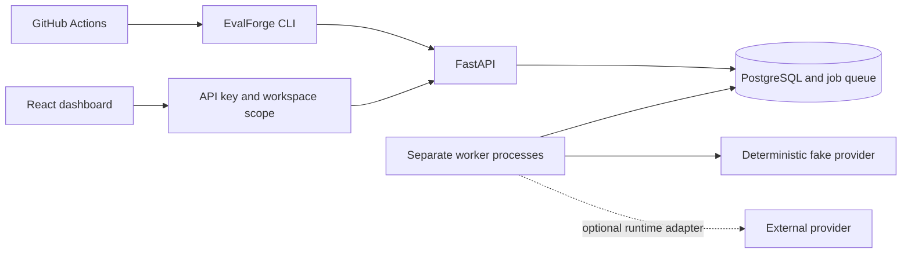

# EvalForge

EvalForge is a small control plane for running repeatable LLM evaluations. The intended workflow is straightforward: keep datasets and prompt/model configurations versioned, run the same checks after a change, compare the result with a baseline, and let CI decide whether the change is acceptable.

The repository includes immutable dataset and prompt versions, safe model configurations,
PostgreSQL-backed evaluation jobs, incremental results, documented metrics, cancellation, retries,
aggregate snapshots, typed regression rules, and a CI-oriented CLI.

## Why this shape

PostgreSQL is both the system of record and the job queue. That keeps run state, job state, and evaluation artifacts in one transaction boundary while the product is still small. Providers are hidden behind an adapter interface, so local development and tests use a deterministic fake provider without credentials or network calls.

There is no Redis, Celery, Kafka, or service mesh in the repository. Those would be reasonable changes only if measured queue throughput, latency, or isolation requirements made PostgreSQL insufficient.

## Architecture



The detailed model and lifecycle are in [docs/architecture.md](docs/architecture.md).

## Stack

- React, TypeScript, Vite, Material UI, and TanStack Query
- FastAPI, SQLAlchemy, Alembic, and Python
- PostgreSQL 16
- A separate Python worker using a PostgreSQL-backed queue
- pytest, Vitest, and Playwright
- Docker Compose for local services

## Repository layout

```text
frontend/  Web application and browser tests
backend/   API, domain model, migrations, metrics, and provider adapters
worker/    Queue polling and job execution process
cli/       Authenticated command-line client for runs, waits, comparisons, and exports
tests/     Backend test suite
docs/      Architecture, lifecycle, metrics, and development notes
infra/     Docker Compose and container definitions
```

## Run locally

Requirements: Docker Desktop, Node.js 20+, npm, and Python 3.11+.

```bash
cp .env.example .env
npm run setup
npm run dev
```

The local services are available at:

- Web app: http://localhost:5173
- API: http://localhost:8000
- API documentation: http://localhost:8000/docs
- PostgreSQL: `localhost:5432`

To run the stack in the background:

```bash
npm run dev:detached
npm run logs
npm run down
```

## Checks

`npm run validate` runs Ruff, mypy, pytest, ESLint, Prettier, TypeScript, and Vitest. Playwright is kept separate because it needs a running frontend:

```bash
npm run validate
npm run test:e2e
```

CI also runs explicit worker/CLI tests, Playwright, dependency and secret scanning, and Docker
builds. See [.github/workflows/ci.yml](.github/workflows/ci.yml).

## Portfolio Materials

- [Three-minute demo script](docs/demo-script.md)
- [Security notes and prompt-injection limitations](docs/security.md)
- [Regression rule interpretation](docs/regression-rules.md)
- [CLI usage](docs/cli.md)
- [Metric definitions](docs/metrics.md)
- [Benchmark runner](benchmarks/README.md)
- [Dashboard screenshots](docs/screenshots/README.md)

Screenshots and demo values are clearly labeled deterministic UI fixtures. No benchmark result is
included until `benchmarks/run_benchmark.py` has been run against a live local stack and writes the
measured output.

## Deterministic Demo

The default `fake` adapter derives its output from `FAKE_PROVIDER_SEED`, model name, and rendered
prompt. It requires no provider key and is the default for tests and local demonstrations. To use
a real provider, configure a model with `provider=openai`, set `OPENAI_API_KEY` only in the runtime
environment or secret manager, and keep the provider out of fixtures and logs. Real-provider runs
are not part of the repository's deterministic tests.

## Known Limitations

- Bearer API keys and workspace assignments are deployment configuration, not a full user/RBAC system.
- PostgreSQL is intentionally used for both persistence and the queue; scale it only after measuring
  queue contention and worker throughput.
- Metrics are imperfect proxies for quality. A passing gate is not a general statement about a model.
- The built-in semantic-similarity metric is a deterministic hashing proxy for reproducible demos,
  not a trained embedding model or a claim of semantic understanding.
- Prompt injection, tool safety, TLS, secret rotation, encryption at rest, and backup policy require
  deployment-level controls described in [docs/security.md](docs/security.md).

The API exposes health and metadata endpoints plus workspace, configured suite, dataset, prompt,
model-configuration, pricing, evaluation-run, baseline, and regression-rule management. Dataset
uploads accept CSV and JSONL, versions are immutable, and the API supports preview/export,
prompt-variable validation, asynchronous execution, cancellation, result aggregation, and
regression comparison. See [docs/regression-rules.md](docs/regression-rules.md) and
[docs/cli.md](docs/cli.md) for CI usage. The data model and API boundaries are documented in
[docs/architecture.md](docs/architecture.md).

## Project rules

The repository rules in [AGENTS.md](AGENTS.md) apply to code, tests, fixtures, and documentation. In particular, results must come from stored evaluation artifacts, provider access must go through adapters, and credentials must stay out of logs and source control.
