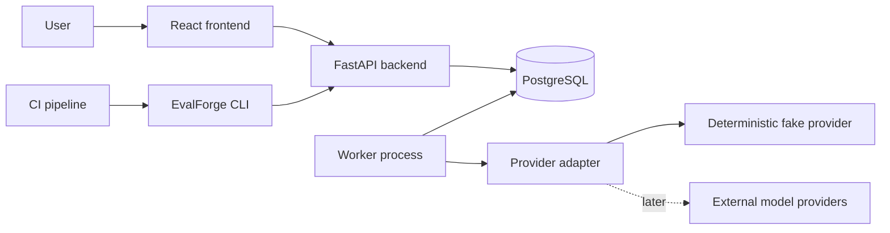
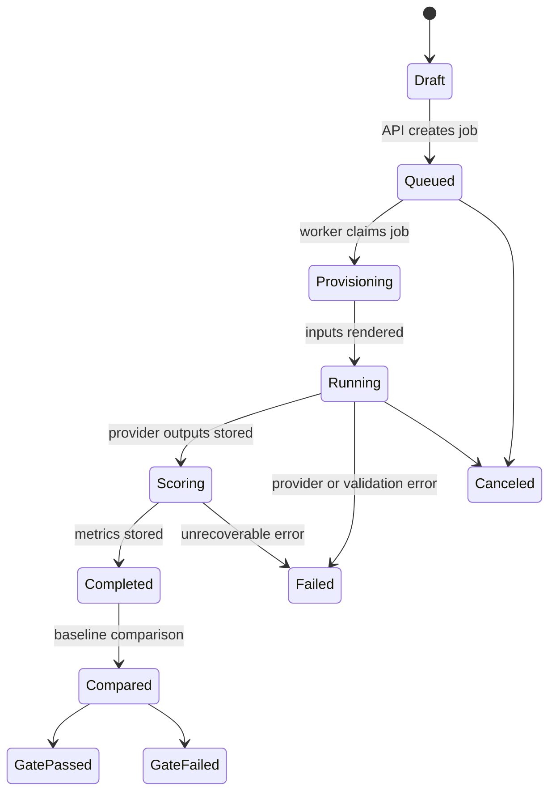

# EvalForge Architecture

## Purpose

EvalForge is an LLM evaluation and regression-testing platform. The system stores versioned evaluation datasets, prompt configurations, model configurations, metrics, and run outputs so teams can compare changes and prevent quality regressions in CI.

This document describes the current system boundary and the decisions that should remain stable as the product grows. Change a boundary when a measured requirement justifies it, and record the reason here.

## Current Limits

- No Redis, Celery, Kafka, or service mesh.
- No microservice split.
- No live external model-provider integration.
- No fabricated evaluation or benchmark data.
- No production authentication model yet.

## System Shape



The backend owns HTTP contracts, validation, persistence, and queue insertion. The worker owns queued job execution. PostgreSQL is both the system of record and the job queue.

## Repository Boundaries

- `frontend`: React application that presents datasets, configurations, runs, comparisons, and CI gate status.
- `backend`: FastAPI API, SQLAlchemy models, Alembic migrations, provider interfaces, queue primitives, and metric registry.
- `worker`: Separate Python process that claims jobs from PostgreSQL with `FOR UPDATE SKIP LOCKED`.
- `cli`: Command-line entrypoint intended for CI regression gates and local automation.
- `tests`: Backend tests and Playwright end-to-end tests.
- `docs`: Architecture, data model, lifecycle, metrics, and development operations.
- `infra`: Docker Compose and container definitions.

## Data Model

All records use UUID primary keys and timestamp columns. Versioned records are immutable once referenced by a run.

### Core Tables

| Table | Purpose | Key Fields |
| --- | --- | --- |
| `datasets` | Logical dataset container | `name`, `description`, `created_at` |
| `dataset_rows` | Versioned input and expected-output examples | `dataset_id`, `input`, `expected_output`, `metadata`, `ordinal`, `version` |
| `prompt_configs` | Prompt template and rendering parameters | `name`, `template`, `variables`, `version` |
| `model_configs` | Provider/model parameters through adapter boundary | `provider`, `model_name`, `parameters`, `version` |
| `metrics` | Documented metric registry entries | `name`, `semantics`, `direction`, `version` |
| `evaluation_runs` | Top-level run request and status | `dataset_id`, `prompt_config_id`, `model_config_id`, `status`, `baseline_run_id` |
| `evaluation_items` | Per-row execution state | `run_id`, `dataset_row_id`, `status`, `rendered_prompt_hash` |
| `evaluation_results` | Per-row model output and provider metadata | `item_id`, `output`, `latency_ms`, `token_usage`, `provider_trace_id` |
| `metric_results` | Per-row or aggregate metric values | `run_id`, `item_id`, `metric_name`, `value`, `details` |
| `evaluation_comparisons` | Baseline vs candidate summary | `baseline_run_id`, `candidate_run_id`, `summary`, `regression_detected` |
| `job_queue` | PostgreSQL-backed execution queue | `kind`, `payload`, `status`, `attempts`, `run_after`, `locked_by`, `locked_at` |

### Important Relationships

- A dataset has many dataset rows.
- An evaluation run references one dataset, one prompt configuration, and one model configuration.
- An evaluation run creates one evaluation item per dataset row.
- The initial schema keeps one evaluation result per item. Attempt history can be added if retries need full output retention.
- Metric results can be item-level (`item_id` set) or aggregate-level (`item_id` null).
- A comparison references exactly one baseline run and one candidate run.
- Jobs reference domain objects through their JSON payload.

## Evaluation Lifecycle



1. Dataset rows are uploaded and validated.
2. Prompt and model configurations are created as immutable versions.
3. The API creates an `evaluation_runs` record in `queued` status and inserts a `job_queue` row.
4. The worker claims the next due job with `FOR UPDATE SKIP LOCKED`, marks it `running`, and records the lock owner.
5. The worker renders prompts, calls the configured provider adapter, and stores outputs.
6. Metrics are computed from documented metric semantics and stored with enough detail for audit.
7. Aggregate results are compared against an optional baseline.
8. The CLI can fail CI when configured thresholds indicate a regression.

## Provider Adapter Boundary

All model providers must be accessed through adapters. The platform never calls provider SDKs directly from route handlers, tests, metrics, or job-queue code.

The default adapter is the deterministic fake provider. It is used for local development and tests to ensure repeatable outputs and avoid accidental cost or secret use.

Adapter responsibilities:

- Render a provider-neutral request into provider-specific format.
- Redact credentials and sensitive provider metadata from logs.
- Return structured outputs, latency, token usage, and trace identifiers.
- Normalize retryable vs non-retryable errors.

## PostgreSQL-Backed Queue

The queue is a `job_queue` table. Workers claim work inside a transaction using row locks:

```sql
SELECT *
FROM job_queue
WHERE status = 'queued' AND run_after <= now()
ORDER BY priority DESC, created_at ASC
FOR UPDATE SKIP LOCKED
LIMIT 1;
```

This is sufficient for the current workload because:

- The expected workload is evaluation jobs, not high-frequency event streaming.
- Job state belongs in the same database transaction boundary as run state.
- Operational complexity stays low.

Redis, Celery, Kafka, or microservices should only be introduced after queue latency, throughput, isolation, or retry requirements are measured and shown to exceed this design.

## API Surface Today

- `GET /health/live`: process health.
- `GET /health/ready`: database readiness.
- `GET /api/v1/lifecycle`: evaluation status vocabulary.
- `GET /api/v1/metrics`: documented metric definitions.

The next API additions are dataset upload, configuration CRUD, run creation, run status, comparison, and CI gate endpoints.

## Regression Gates

CI should use the CLI against the API. The CLI will:

1. Create or identify a candidate run.
2. Wait for completion.
3. Compare against a configured baseline.
4. Exit non-zero only when documented thresholds are violated.

CI output must report only stored results. It must never invent benchmark numbers when a run has not completed.

## Security And Secrets

- API keys are only loaded from environment variables or secret managers.
- API keys are never logged, committed, stored in fixtures, or returned by API responses.
- Provider adapters must redact credentials before emitting logs or errors.
- Local `.env` files are ignored by git.

## Observability

The API and worker use structured logs. The next observability additions are request IDs, run IDs, metrics timing, and provider error categorization.

## Validation Requirement

Before completing a change, run:

```bash
npm run validate
```

For infrastructure changes, also verify:

```bash
npm run dev:detached
docker compose -f infra/docker-compose.yml ps
```
