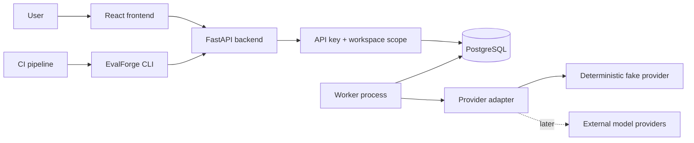
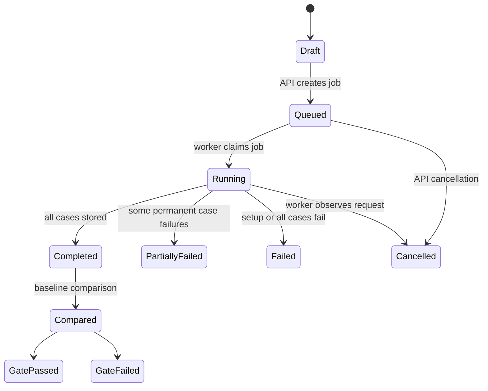

# EvalForge Architecture

## Purpose

EvalForge is an LLM evaluation and regression-testing platform. The system stores workspace-scoped evaluation datasets, immutable prompt and dataset versions, model configurations, metrics, and run outputs so teams can compare changes and prevent quality regressions in CI.

This document describes the current system boundary and the decisions that should remain stable as the product grows. Change a boundary when a measured requirement justifies it, and record the reason here.

## Current Limits

- No Redis, Celery, Kafka, or service mesh.
- No microservice split.
- External providers are optional and adapter-bound; local development and tests use the fake provider.
- No fabricated evaluation or benchmark data.
- Production API authentication is environment-configured bearer keys with explicit workspace assignments.

## System Shape



The backend owns HTTP contracts, validation, persistence, and queue insertion. The worker owns queued job execution. PostgreSQL is both the system of record and the job queue.

## Repository Boundaries

- `frontend`: React application that presents datasets, configurations, runs, comparisons, and CI gate status.
- `backend`: FastAPI API, SQLAlchemy models, Alembic migrations, provider interfaces, queue primitives, and metric registry.
- `worker`: Separate Python process that claims jobs from PostgreSQL with `FOR UPDATE SKIP LOCKED`.
- `cli`: Command-line entrypoint intended for CI regression gates and local automation.
- `tests`: Backend tests and Playwright end-to-end tests.
- `docs`: Architecture, data model, lifecycle, metrics, and development operations.
- `infra`: Docker Compose and container definitions.

## Data Model

All records use UUID primary keys and timestamp columns. Versioned records are immutable once referenced by a run.

### Core Tables

| Table | Purpose | Key Fields |
| --- | --- | --- |
| `workspaces` | Tenant boundary for management resources | `name`, `slug`, `description` |
| `managed_datasets` | Mutable dataset metadata | `workspace_id`, `name`, `slug`, `tags` |
| `dataset_versions` | Immutable validated dataset snapshot | `dataset_id`, `version_number`, `source_format`, `content_hash` |
| `evaluation_suites` | Reusable executable evaluation configuration | `workspace_id`, `dataset_version_id`, `prompt_version_id`, `model_configuration_id`, `metric_names` |
| `test_cases` | Required input/output row plus metadata | `dataset_version_id`, `row_number`, `input`, `expected_output`, `tags` |
| `prompt_templates` | Named prompt container | `workspace_id`, `name`, `slug`, `tags` |
| `prompt_versions` | Immutable template text and extracted variables | `prompt_template_id`, `version_number`, `template`, `variables` |
| `model_configurations` | Safe provider/model settings | `workspace_id`, `provider`, `model_name`, `temperature`, `max_tokens`, `timeout_seconds` |
| `metrics` | Documented metric registry entries | `name`, `semantics`, `direction`, `version` |
| `managed_evaluation_runs` | Run request and status | `workspace_id`, `dataset_version_id`, `prompt_version_id`, `model_configuration_id`, `status` |
| `managed_evaluation_results` | Per-test-case model output | `run_id`, `test_case_id`, `output`, `latency_ms`, `token_usage` |
| `managed_metric_results` | Per-row or aggregate metric values | `run_id`, `test_case_id`, `metric_name`, `value`, `details` |
| `provider_pricing` | Editable effective-dated cost configuration | `workspace_id`, `provider`, `model_name`, `input_cost_per_1k`, `output_cost_per_1k`, `effective_from` |
| `run_aggregates` | Materialized run, dataset, tag, prompt, and model summaries | `run_id`, `scope_type`, `scope_key`, `metric_name`, `value` |
| `baselines` | Named completed run reference | `workspace_id`, `name`, `evaluation_run_id` |
| `regression_rules` | Typed threshold attached to a baseline | `baseline_id`, `rule_type`, `metric_name`, `tag`, `operator`, `threshold` |
| `job_queue` | PostgreSQL-backed execution queue | `kind`, `payload`, `status`, `attempts`, `run_after`, `locked_by`, `locked_at` |

### Important Relationships

- A workspace owns suites, datasets, prompt templates, and model configurations.
- A dataset has immutable versions; each version owns numbered test cases.
- A prompt template has immutable versions. Creating a new template text creates the next version.
- Prompt variables are extracted from `{{ variable }}` placeholders and can be checked against a dataset version before a run.
- An evaluation run references one dataset version, prompt version, and model configuration.
- An evaluation result belongs to one run and one test case. Metric results may be item-level or aggregate-level.
- A baseline names a completed run, and regression rules attach metric thresholds to that baseline.
- Jobs reference domain objects through their JSON payload.

## Evaluation Lifecycle



1. Dataset rows are uploaded and validated.
2. Prompt and model configurations are created as immutable versions.
3. The API creates an `evaluation_runs` record in `queued` status and inserts a `job_queue` row.
4. The worker claims the next due job with `FOR UPDATE SKIP LOCKED`, marks it `running`, and records the lock owner.
5. The worker renders prompts, calls the configured provider adapter, and stores outputs.
6. Metrics are computed from documented metric semantics and stored with enough detail for audit.
7. Aggregate results are compared against an optional baseline.
8. The CLI can fail CI when configured thresholds indicate a regression.

## Provider Adapter Boundary

All model providers must be accessed through adapters. The platform never calls provider SDKs directly from route handlers, tests, metrics, or job-queue code.

The default adapter is the deterministic fake provider. It is used for local development and tests to ensure repeatable outputs and avoid accidental cost or secret use.

Adapter responsibilities:

- Render a provider-neutral request into provider-specific format.
- Redact credentials and sensitive provider metadata from logs.
- Return structured outputs, latency, token usage, and trace identifiers.
- Normalize retryable vs non-retryable errors.

## PostgreSQL-Backed Queue

The queue is a `job_queue` table. Workers claim work inside a transaction using row locks:

```sql
SELECT *
FROM job_queue
WHERE status = 'queued' AND run_after <= now()
ORDER BY priority DESC, created_at ASC
FOR UPDATE SKIP LOCKED
LIMIT 1;
```

This is sufficient for the current workload because:

- The expected workload is evaluation jobs, not high-frequency event streaming.
- Job state belongs in the same database transaction boundary as run state.
- Operational complexity stays low.

Redis, Celery, Kafka, or microservices should only be introduced after queue latency, throughput, isolation, or retry requirements are measured and shown to exceed this design.

## API Surface Today

- `GET /health/live`: process health.
- `GET /health/ready`: database readiness.
- `GET /api/v1/lifecycle`: evaluation status vocabulary.
- `GET /api/v1/metrics`: documented metric definitions.
- Workspace and evaluation-suite CRUD under `/api/v1/workspaces`.
- Dataset CRUD, CSV/JSONL upload, manual version creation, preview, and JSONL export.
- Prompt template CRUD, immutable version history, dataset-variable validation, and version comparison.
- Model-configuration CRUD and provider availability under `/api/v1/model-configurations` and `/api/v1/model-providers`.
- Evaluation run creation, status, results, cancellation, effective-dated provider pricing, and aggregates under `/api/v1/evaluation-runs` and `/api/v1/provider-pricing`.

Baseline management, typed regression rules, comparison, and the CI CLI are product layers on top
of the execution API. Rule interpretation is documented in [regression-rules.md](regression-rules.md).

## Regression Gates

CI should use the CLI against the API. The CLI will:

1. Create or identify a candidate run.
2. Wait for completion.
3. Compare against a configured baseline.
4. Exit non-zero only when documented thresholds are violated.

CI output must report only stored results. It must never invent benchmark numbers when a run has not completed.

## Security And Secrets

- API keys are only loaded from environment variables or secret managers. The OpenAI adapter reads `OPENAI_API_KEY` and never stores it in `model_configurations`.
- Set `API_AUTH_REQUIRED=true` and map bearer keys with `API_KEY_WORKSPACES` before exposing the API outside local development.
- API keys are never logged, committed, stored in fixtures, or returned by API responses.
- Provider adapters must redact credentials before emitting logs or errors.
- Local `.env` files are ignored by git.

## Observability

The API and worker use structured logs. Provider and job failures are categorized without storing
raw provider exception text. Request IDs and broader tracing remain future observability work.

## Validation Requirement

Before completing a change, run:

```bash
npm run validate
```

For infrastructure changes, also verify:

```bash
npm run dev:detached
docker compose -f infra/docker-compose.yml ps
```
